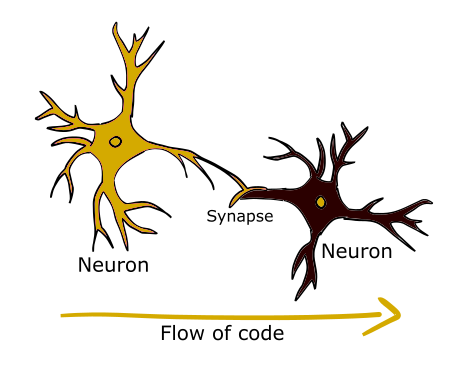
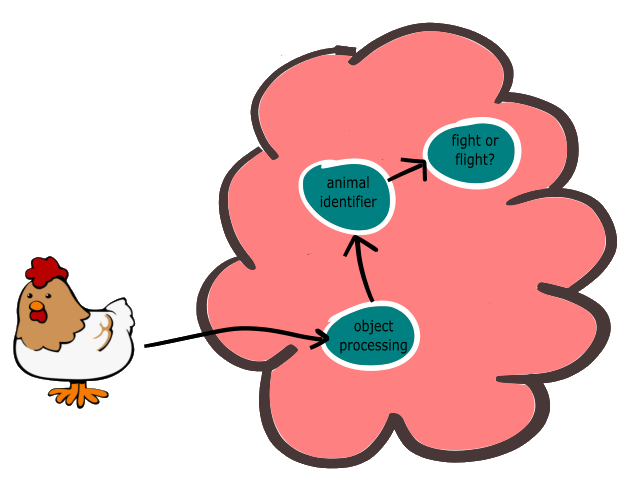
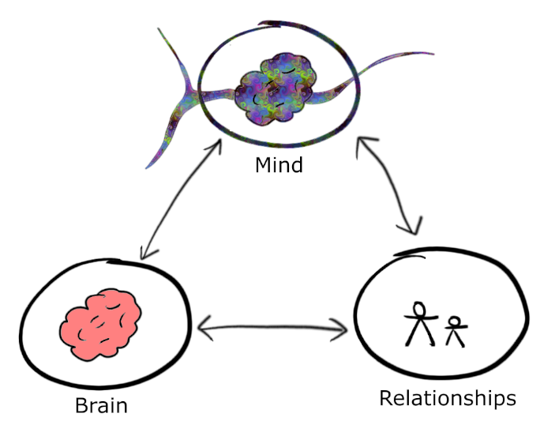
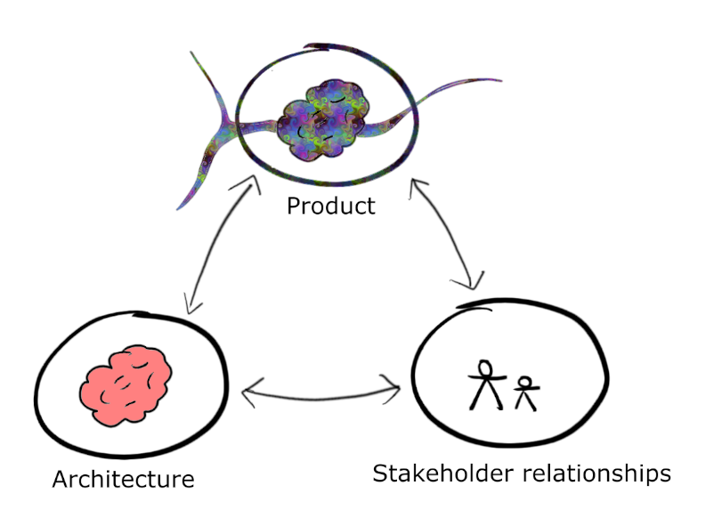

Many digital products, despite great intentions, easily devolve into a mess of seemingly impenetrable technical debt, impossible stakeholder requests and relentless stress for all involved. This deterioration is mostly due to the inherent difficulty of any singular person, team or organisation grasping the product's complexity enough to make good decisions. And that is a fact of Big Tech life we can't solve for. But can we make things a bit better? What can we do to design healthy and resilient complex systems that don't crash and burn? Why, we copy the most complex system we know, of course! We copy the brain.

Enter a groundbreaking field - a new way of seeing the brain, the mind, and our relationships - Professor Daniel Siegel's Interpersonal Neurobiology (IPNB). IPNB is a fascinating field, stressing how a healthy mind can be achieved through maximising both the independence of our roles within relationships, as well as maximising the strength of our connections with our relations. This seems like a paradox at first, but makes sense if you think about your healthiest relationships - you were both allowed to be fully yourself, and yet connected very intimately with the other person. What's even more interesting is that the structure of our brains mirrors this paradox - a healthy brain both has very independent clusters of neurons, and strong connections between these clusters.

We are already all familiar with Artificial Neural Networks and the benefits those have brought to machine learning. However, modern system architecture within large-scale digital products we build shows remarkable parallels to the brain. Let's explore this analogy, and see what it could practically mean, when we bring IPNB into the equation. What emerges is a new way to think of a Microservices Architecture as a brain, and therefore a healthy digital product as a healthy mind.

The analogy between the brain and Microservices Architecture
-------
First, let's explore our analogy on a high level, and then use this analogy to talk about maintaining a healthy Product\* through the eyes of IPNB. Throughout this article, we will reference IPNB, and all credit goes to Daniel Siegel's [The Developing Mind](https://www.amazon.com/Developing-Mind-Third-Relationships-Interact/dp/B088FWWLLF/). A gripping book, and highly relevant to anyone wanting to learn how we can intentionally build a healthy mind, whether our own minds or those of our children.

_\*Note: I have capitalised "Product" because its definition is going to become very important, and I don't believe a more accurate word currently exists for the Product analogy which we will explore in this article. Secondly, I'm an ex technical product manager, and the way of the Product dies hard!_

Within your Product, there are many, many lines of code or logic. Although we won't go into code-level detail in this article, let's consider each **logical action within code as a neuron**. Each action can be triggered by an external input, and in turn calls the next action(s) in series or parallel, through **one or many synapses** - connections between neurons.

The brain consists of about one hundred billion neurons, each with an average of ten thousand synapses connecting them to other neurons. It's a pretty damn complex system. Similarly, your Product's architecture consists of probably thousands of actions in code, connected to other actions in a multitude of paths depending on the operation being performed or the input from the user or scheduled job. 

Let's start the analogy by considering the brain analogous to your Product's code / architecture, although let's be honest - that is rather unfair to the brain! Much like your brain, your system’s architecture can be arranged in all sorts of ways. Some, such as one big monolith of spaghetti architecture, would not be good. But others, such as a [Microservices Architecture](https://martinfowler.com/articles/microservices.html) or [Reactive Architecture](https://www.reactivemanifesto.org/), would be a good choice to build something really complex. Not too coincidentally, the brain runs on microservices, too (For those not familiar with Microservices Architecture, it is a natural evolution of Service Oriented Architecture that concerns splitting up your Product/application into many small services, each independent from the others and built around a specific business capability. Most modern applications are now built this way.)

**Microservices, and other systems such as big data stores, are analogous to clusters of neurons in the brain, or "nuclei."** that fire together and share common inputs. Some have externally facing APIs, some are only internally facing. They receive input at a larger scale (which can be from many sources) and decide whether or not to produce output, to store it, or so on. Taking it one step higher, the brain can also be divided into regions, even **hemispheres**. We do the same in systems architecture - we have **layers of services, and separate them by function**.

Connections between microservices (APIs, kafka, ETL, etc.) are also analogous to **strong synaptic connections**. In our brains, commonly used connections grow stronger, forming "APIs" of their own - very strong synaptic highways. 

From this architecture, stems a Product offering to your users. Just like we are an emergent property of our brains, the Product you are building is analogous to the **mind**. We will explore this more in a second, but let's go with a definition of the mind from IPNB. The mind is

* An embodied and relational process that regulates the flow of energy and information
* An emergent property of both the brain, and relationships with others.

It is not hard here to see how this applies to your Product, being 

* a system that regulates the flow of information
* and an emergent property of its architecture and its relationships with users and other stakeholders.

What makes a healthy brain - IPNB on "Integration"
-------
So now that we've set ourselves up with an analogy between the brain and a Microservices Architecture, and the mind and your Product, let's start to look at what makes a healthy brain. Of course, many things go into building a healthy brain, such as diet, mental exercise, physical exercise, and probably a host of things we don't understand fully. However, from the perspective of IPNB, we can sum things up from another angle:

Firstly, a healthy brain finds a maximum of both the **independence** of clusters of neurons (nuclei), and **strength of connections** between those clusters. Think of it as a bunch of big, independent cities, but with large highways between them. Each city can grow independently, has its own mayor, and doesn't fully rely on the other city for its survival. However, they are also very connected. It's easy to move between cities for your commute, or to transfer goods between.

Very interestingly, the mind mirrors this relationship as if it were one nucleus, and other people's minds were other nuclei. The mind is considered healthy when it maximises both its independence from others, and fosters strong connections with others. This concept of maximising both independence and connection (whether of your brain or mind) is called **"Integration"** in IPNB.

This can be a bit confusing at first! How can you maximise both independence and connection? But it's easier to think of in personal terms. Think of the best friend or healthiest relationship you had. They gave you enough space to be you, and you weren't scared to be yourself, or indeed do your own thing when around them. However, you also fostered a strong connection and had deep discussions about intimate details of the other. Hopefully, neither of you relied too much on the other, because you were the right balance of independent, rather than codependent or needy. Relationships that honour differences and independence, whilst still cultivating connection are awesome. This is how things work both inside a healthy brain, between nuclei, and between a healthy mind and others.

Now, if you do not have a good state of Integration, your brain either becomes too chaotic, or too rigid, and mirroring this, your mind either become too chaotic, or too rigid. Think about when you're stressed or anxious, how hard it is to control your thoughts and turn them positive. Versus when you are happy and relaxed, and how easy it is to channel your mind in the direction you'd like. That's the difference between chaos and health.

One of the central teachings of IPNB is that the health of your brain, your mind, and your relationships are very connected. A simple way of looking at this is in the triangle below. The mind, the brain, and relationships are "three aspects of one reality." Affecting one affects the others. Caring for one positively affects the others.

So what does this mean for our Product analogy? Let's explore several ideas, one by one. Please remember to take everything with a cynical pinch of salt. This is just an analogy! However, let's start with one unarguable learning about Product Management stemming from IPNB's triangle, and take it from there.

Lesson one: The three aspects of your Product's reality impact each other
-------
The mind, relationships, and  your brain are three aspects of one reality. In the same way, your Product, its architecture, and your stakeholders, are three aspects of one reality.

Positive changes in one of the facets results in positive changes in the others. For instance, building a healthy relationship with your stakeholders will result in a more solid understanding of what you can deliver for them within a set period of time. This results in a more realistic expectation of your deliverables, and therefore more time to safely deliver without producing technical debt. You've positively impacted your Product (in the long run, at least) and your architecture.

The opposite of this holds true, too. A bad lead engineer making incorrect architectural decisions can have devastating results a year or two down the line when you realise you need to rewrite a large portion of your systems due to speed or reliability issues. A bad actor in your architecture (brain) has caused your Product (mind) to be negatively affected, and your stakeholders are not happy with the sudden delay in features they want due to the time required to fix your systems.

Lesson two: Healthy stakeholder relationships lead to a healthy Product - especially early on in the product lifecycle
-------
In IPNB, healthy relationships (especially early on in life) are one of the primary drivers of well Integrated mental health. This early life process is called attachment, and "may be the central foundation from which the mind develops."

The same holds true when building a healthy Product. Good stakeholder relationships lead to good Products, especially early on. We, as product managers, CEOs, or investors, tend to drive the product management process early on as visionaries, building something tangible before taking it to potential stakeholders, especially our users. This is not ideal - we should indeed be driving the process, but with far more input from stakeholders. The earlier on our Product grows from its relationships, the lower the cost of change later on in the process.

Secondly, choosing the right stakeholders, and nurturing a healthy relationship with them, is of utmost importance. There is no magic bullet here - just to seek out healthy relationships with stakeholders, and nurture those relationships through regular, honest, Integrative talks.

Lesson three: Maximise "Integration" within your Product
-------
The mind is at its healthiest with maximised Integration: Nuclei are both very complex and independent, whilst extremely interconnected.

Obviously, taking this too far in systems architecture neglects some pragmatism, especially in the humble beginnings of your Product. We can't necessarily have a different cloud hosting package or a different database for each microservice, making them extremely independent. Furthermore, we benefit massively from shared libraries between services. However, there is a lot to take from the concept of integration here, in order to achieve scalability, reliability, and reusability of your architecture.

To maximise independence of microservices, we essentially want to avoid the negative impact that a change in functionality, or outage of one service, has on the operation of the rest of the Product:

* Microservices should enable a separation of concerns: each should be designed with a single function in mind, e.g. storing and retrieving a user's shopping cart details, or creating or changing their password. Within reason, each microservice stores its own independent data and logs.
* Microservices should be loosely coupled: Separated by APIs, they remain as independent of each other and of their dependencies as possible. And equally importantly, this independence should enable resilience in the case of dependency failure - [resilient dependency management](https://searchapparchitecture.techtarget.com/tip/3-microservices-resiliency-patterns-for-better-reliability).
* To enable and encourage the resilience of microservices from dependency failure, it's common practice to purposefully crash dependencies, using [chaos testing](https://www.ibm.com/garage/method/practices/manage/practice_chaotic_testing/) (or organised drills, if you're not quite ready for chaos) is the way to go.
* Independence does not mean rigidity, but rather independence as you'd see a child allowed to have her own interests and make her own mistakes in the process of growing up. Especially early on in the development process, it is very important that there is a lot of slack in your services for change. Because as you take upon new stakeholder relationships, there will be requirements that change. Just like a child's brain - very malleable, and willing to accept many forms and learnings.

And with each microservice's independence, we also should strive to maximise the strength of connections between each. Of course, we don't want to go all out 'brain' here and build connections flailing around that are rarely used or just experimental. Again, pragmatism. However, there are several principles one should live by:

* This is common sense, but APIs should be clear and well documented. Easy understanding of APIs through good documentation, organisation, and naming conventions, through architectures like [HATEOAS](https://en.wikipedia.org/wiki/HATEOAS) pays massive dividends down the line, by minimising misuse or misunderstandings of your API, and reducing support.
* Each and every connection should have its availability, latency and reliability (even if a simple measurement, like measuring 200s versus 400s) measured through [SLOs](https://sre.google/sre-book/service-level-objectives/). One can not stress the strength of SLOs enough. They are Google's way of measuring the symptoms that clients (in this case, other microservices) experience when communicating with your services. Each SLO is a simple metric, such as "the percentage of API calls within 100 milliseconds."
* ALERT on these SLOs. One of the biggest lessons I learnt as a technical product manager was to [alert on symptoms, and not causes](https://paulbellamy.com/2017/08/symptoms-not-causes). Adding alerts for arbitrary causes (such as a specific type of error) only catch errors you have in the past. Alerting on symptoms - in other words strange API behaviour in your microservices - catches every error that your client may experience. And there's no better technical way to alert on symptoms than through SLO alerts. It's cheaper to implement, easier to implement, and easier to understand. There are many different ways to do this, but [budget burn](https://cloud.google.com/stackdriver/docs/solutions/slo-monitoring/alerting-on-budget-burn-rate) is the tried and tested.
* Along with each service's individual tests, your Product needs a well-maintained end to end testing suite that tests the quality of connections between microservices.

Lesson four: Maximise "Integration" between your Product and stakeholders
-------
As mentioned in Lesson Two, in IPNB, healthy relationships (especially early on in life) are one of the primary drivers of well Integrated mental health. This continues through adult life, though. It's shown that Integration applies not just within our brain, but between individuals as well.

Similarly, we can strive for Integration between our Products and stakeholders:

* Maximise independence: In my experience, this can be a hard pill to swallow, but your Product also needs to remain respectfully independent from your users and stakeholders. Unhealthy attachments to a small subset thereof can result in biased Products that lose the plot. Several times in my career, an unhealthy senior stakeholder has risked driving a product off the rails due to having too heavy an influence on the product. In fact, almost every product mistake that you can make as a manager comes from neglecting a subset of stakeholder needs due to a particularly vociferous stakeholder. This vociferous one can be you, too! With all of your unconscious biases, you make plenty of mistakes. Therefore, keep your Product respectfully independent from yourself in the same way as you do from others.
* Regularly survey all of your stakeholders: You probably do already, but do you ask them about the quality of your relationship with them? Remember, your teams are your stakeholders, too. Their healthy relationship with the Product they work on is of utmost importance.
* Maximise the strength of connections to your users: everything from Lesson 3 in terms of SLOs, alerting on SLOs, and clear, well documented APIs applies to your API relationships with your users. Here, of course, it can be a bit harder to measure your users' experience - metrics can be harder to implement from the user's perspective, and you sometimes need to rely on Google analytics or other front end data.
* Finally, and probably most importantly in the long run, the strength of your connection with your users is defined by the quality and quantity of the data you store. Data quality, especially when building a new product, is too often ignored in lieu of new features. This comes back to bite you in the long term, when two years down the line you find you haven't stored a crucial user behavioural data field that would have otherwise enabled you to make a now-critical business decision.

Lesson five: Healthy Product states are self-fulfilling
-------
In IPNB, when the brain is in good health, with maximised Integration, it creates new synapses. It builds itself into a better brain, having a positive impact on both the mind and relationships. However, exactly the same mechanisms enabling this can inflame the brain and cause unhealthy mental states when we encounter unhealthy situations or inputs. One bad actor in your environment can wreak havoc, and it can be hard to escape the ensuing rut. Conversely, a good actor can take you out of a rut equally well.

Often when you find yourself craving "me-time," it is a natural cry for help from your brain: we need time away from external influence, in order to process and reset.

The same balance exists in your architecture and mind. If your systems are in a healthy state, you are blessed with time to build new features, and further improve the health of your systems. The freedom buys time for innovation, and can spawn new products and revenue streams. Conversely, an unhealthy system can get you in a rut of bug fixing or support, resulting in rushed work and further bug fixing and support in the future as you try to dig yourself out of this rut. 

It is hard to come up with practical advice for these implications, beyond that you should pay attention to the little things and people. Survey your teams. Have regular retrospectives. Often, the heralds of doom are not the leadership team, but one analyst or UX designer quietly sulking in the corner, or complaining to their manager. Those same people can be the saviours. Secondly, set aside formal Product teams' "me-time," time to reset, retrospect, and process - whether through hackathons, buffer times in roadmaps, or time laid aside for technical debt. We can't work full steam ahead for very long without burning out.

Lesson six: The Reactive Manifesto
-------
The other five lessons look at aspects of the mind or brain, and how that can apply to your system's architecture. Number six reverse-engineers the analogy a bit. One of the foremost ways at designing truly scalable and resilient systems today is [Reactive Architecture](https://www.reactivemanifesto.org/), an evolution of Microservices Architecture. As Products have grown in scale, many systems have naturally evolved to Reactive out of pure need - because it's the only way to deal with large scale data processing on the cloud. The best practices that evolved in many of these systems, dubbed The Reactive Manifesto, are very similar to what we've discussed here.

Like the brain, a Reactive Architecture is lightning fast in responses. Its services stay resilient in the face of self or dependency failure. It is elastic to increased workload. Finally, it is entirely message driven.

Bringing it all together
-------
The demands of building a global-scale Product have changed the way we need to look at our systems. It's no longer possible for one person to understand an entire architecture, and laughable to think we have fine control over huge systems and their failures. So rather than micromanage our systems, let's try to keep them healthy as a whole. Let's learn from a relatively new branch of science: Interpersonal Neurobiology (IPNB). A healthy brain is analogous to a healthy system architecture, and therefore a healthy mind is analogous to a healthy digital product - both within the workings of this Product and between the Product and its stakeholders. 

So if we want to treat our Products with care, what can IPNB teach us?
* First things first, we need to have a good architecture enabling any more good practices: a Reactive or Microservices architecture
* Our system architecture, our relationships with our stakeholders, and our Product are all three aspects of one reality. Influencing one aspect affects the others
* "Integration" within our architecture results in a healthy evolution of the architecture over time. This is established by strengthening the independence of microservices within our architecture (through good design and dependency management) and strengthening the connections between these microservices (through excellent APIs, SLOs, alerts and end to end testing) 
* "Integration" between our Product and stakeholders results in a healthier Product over time. A healthy relationship with our stakeholders is the most crucial aspect in this - especially in the early product development phase. When we can, we must pick the right stakeholders or voice thereof, especially early on. We must pay special attention to our stakeholder relationships, including those of our teams.
* A healthy Product state becomes self-fulfilling. We should seek out this state, and enable our Product a lot of "me-time" to reset and achieve this.

