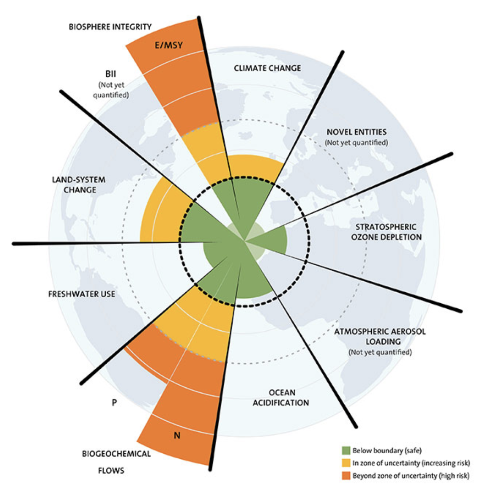
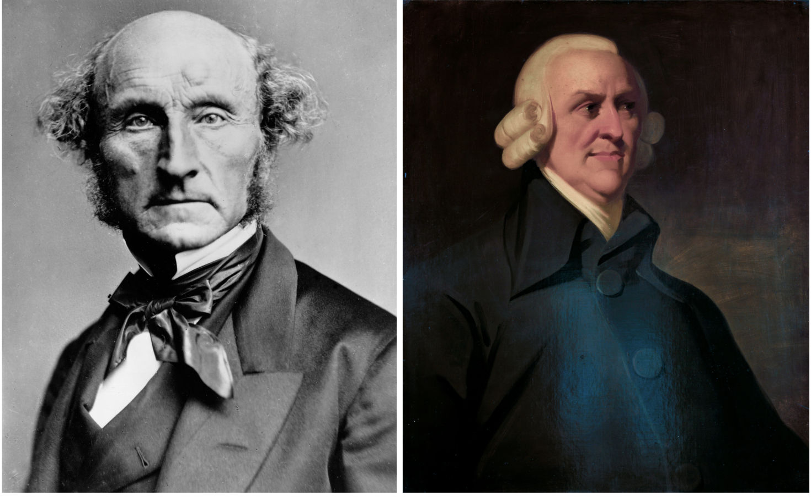
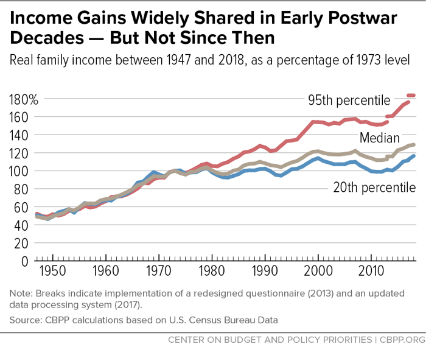
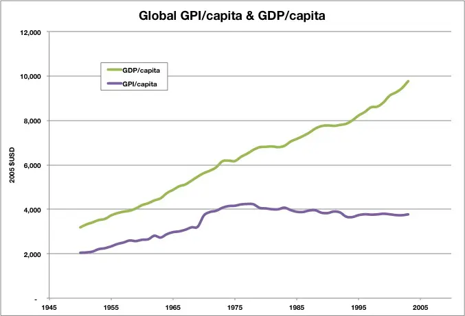

_This piece has been published in [The Mail and Guardian](https://mg.co.za/thoughtleader/opinion/2023-06-04-its-time-to-end-the-societal-pursuit-of-growth/)_

This is an article on economics. It’s highly political, cynical, ranty, and anti-capitalist. It also raises far more problems than solutions. So why read it, if not an economist? (Or why write it, as a data scientist?)

This is probably the most relevant and important analytical topic we’ll ever touch in our avenue of work. We, as white-collar workers, especially data scientists, analysts, product managers and even senior leadership, are all about picking the right metrics to measure success of what we do at work. 

Yet, the **entire world** is driven by a deeply entrenched metric that is leading us to our doom - no exaggeration. The metric is not sustainable, and it’s one of the main reasons why we can’t combat climate change, income inequality, dwindling resources, or many other things wrong with the world.

It’s growth, or at least growth in its current form: Gross Domestic Product (GDP). Your company’s bottom line. The relentless pursuit of more.

_Side note:_ This rant borrows multiple ideas from the book _Prosperity Without Growth_ by Tim Jackson. Credit where credit is due. However, I don’t always agree with the ideas there. In fact, I am pro-growth. I'd just like to measure it differently. If  this article tickles your fancy, be sure to give the book a read, as it goes into these concepts far more in-depth, and with more references than here.

## Let’s first agree on the problem

Let’s be very brief and lax on citations when spelling doom for the world, because climate change and other impending problems don’t even need to be argued at this point.

The world is bursting at the seams. [We are overshooting multiple critical planetary boundaries](https://www.stockholmresilience.org/research/planetary-boundaries.html): We lie beyond the ‘safe operating space’ of the planet in four of nine critical boundaries: Nutrient loading, species loss, ocean acidification and climate change. **Every single one of them spells the end of life as we know it. Climate change isn’t necessarily even the worst one.**

_Critical Planetary Boundaries (Source: [Stockholm Resilience](https://www.stockholmresilience.org/research/planetary-boundaries/the-nine-planetary-boundaries.html))_

 \
[The 2018 Special Report of the Intergovernmental Panel on Climate Change](https://www.ipcc.ch/2018/10/08/summary-for-policymakers-of-ipcc-special-report-on-global-warming-of-1-5c-approved-by-governments/) indicates that, in the absence of speculative negative-emissions technologies, **the only feasible way to remain within safe carbon budgets is for high-income nations to actively slow down the pace of material production and consumption**. Our carbon emissions ‘budget’ in order to limit global warming to 1.5 degrees will, at current pace, be exhausted within a decade or less. In other words, if we stopped all carbon emissions in a decade - factories, cars, the lot - we’d still warm the planet by 1.5 degrees.

That’s it for the problem - I’m not even going to link to more sources than those two. There are literally thousands of predictions of when, and how, things are going to get very gnarly if we continue down the path we’re going.

## So why haven’t we changed our behaviour to save the world?

We, as consumers, keep buying more things, flying to more places, replacing our phones and gaming consoles as soon as a new one is released, buying new instead of repairing. Why, given we know the damage it does? Because we act in our own best interest - each of us just trying to survive our own seemingly difficult life can easily justify a holiday to escape the winter depression, or some new clothes to feel good about ourselves. After all, it’s just a tiny impact from our one purchase.

But then, at the higher level, why aren’t governments and organisations acting in the best interests of our collective future? Why are our retirement funds, the very embodiment of our future safety, reliant on fossil fuels, cigarette companies, and consumerism as a whole? Obviously our current toll on the earth is a stupid idea. So why are we allowing ourselves to be so collectively naughty?

Here’s the crux: A very large part of this crisis (not all, of course) is not being directly caused by human beings, but by a deeply entrenched economic system and mindset: a system that relies on continuous expansion, disproportionately to the benefit of a small minority of rich people. Growth. 

## A quick history of growth, prosperity and capitalism

_Smith and Mill: their hairstyles as outdated as their economic policies. Image sources [[Wikipedia](https://en.wikipedia.org/wiki/Adam_Smith#/media/File:Adam_Smith_The_Muir_portrait.jpg)], [[Wikipedia](https://en.wikipedia.org/wiki/John_Stuart_Mill#/media/File:John_Stuart_Mill_by_London_Stereoscopic_Company,_c1870.jpg)]_

Humans evolved in an environment of scarcity. We sparsely populated the planet. Food was rare. Physical safety was hard to come by, and health was short lived. This continued for most humans well into the 1900s, and still continues today in the developing world. Our survival was paramount, and technology was the solution.

GDP and growth has humble and well-intentioned roots, à la Economics 101: Humans evolved in an environment of scarcity, which continued well into the 1900s, and still continues today in the developing world. Economists like Smith, Mill, and Keynes theorised that a free market, which incentivised companies to maximise profit, and people to invest in these companies, created a positive feedback loop producing novel products and services. The innovation produced by these companies would lead to better health, longevity, and happiness for humans, because people buy the things that make them healthy, safe and happy. And as they can buy more of these things, they’re healthier, safer, and happier. So, by recording the amount of things that we make and sell, voila! We have a metric for human progress. The more GDP, the better. Full-scale capitalism ensued, and pushing GDP led to prosperity and social progress in many countries.

Side note, jumping ahead: Both Mill and Keynes alluded to the fact that this growth model would only be relevant for a while - until a model of steady state. Mill said that “the best state for human nature is that which, while no one is poor, no one desires to be richer, nor has any reason to fear being thrust back, by the efforts of others to push themselves forward” Keynes said that one day the “economic problem would be solved and we would prefer to devote our further energies to non-economic purposes”. In other words, we’ve taken things written down by people in completely different economic times, and still apply them today. But actually, they had already dreamt ahead to today and we’ve forgotten about that part.

So for a long time, our fathers of modern economics were right! Tackling growth of GDP led to prosperity and social progress, at least in the countries that did grow. 

But capitalism - the enormous engine of growth that feeds itself - is pretty sticky. It has set in so hard - to our governments, our culture, our very egos - that we can’t get rid of it. Our economic stability depends on growth. Our individual futures - our retirement funds - rely on it. Our governments wouldn’t make it through the next election if they suggested a zero growth target to their GDP.

Now, you know where this is going. We’ve gone too far. We’ve overshot, overcapitalismed the world. We’ve managed to not just ignore the long term future for our own retirement funds, but to **deeply entrench and encourage the model that does this**. 

We have a **continually growing economic beast (which must be fed more growth) which is coupled to a finite ecological system.**

## Problems with our current economic state

So what’s actually wrong with Growth? There’s no need to state some of the obvious - I’m leaving out pollution, climate change and overuse of raw materials and land - that would just be a sad list of things we’ve made too much of and things we’re running out of. However, all of the below problems are less obvious systematic issues linked to our relentless pursuit of growth. 

### Growth - GDP - isn’t actually correct.

GDP is too selective. It takes all the short term positives, and forgets about the very relevant long term negatives. Serge Latouche, a professor of economics, [shows that](https://www.academia.edu/37030423/_Farewell_to_Growth_Polity_2010_By_Serge_Latouche_Ebook_PDF_Degrowth) if you take growth in GDP, and subtract damages caused to the environment from that, you get zero or negative growth. For instance, in Indonesia, it found that the rate of growth between 1971 and 1984 would be reduced from 7.1 to 4% annually, and that was by taking only three variables into consideration: deforestation, reduction in oil and gas reserves, and soil erosion. To make an accounting analogy: It’s as if a company is recording all its profits, but not recording most of its debts. 

Secondly, remember the idea that drove capitalism - that we buy things which make us happy, healthy and safe, and this drives production, hence GDP? Well, this isn’t actually entirely correct.  We can now create GDP without even touching people’s happiness, by creating loans and investments for goods and services which never reach the end consumer, but instead are just Business to Business (B2B), fill a landfill, or feed some other black hole of goods and services that doesn’t improve society. 

Moreover, our happiness from goods and services is not linear. Your first meal after not eating for a week is worth much much more to you than the 30th meal in a week. Yet GDP assigns them the same value. and past a point, more consumption doesn’t make us happy at all. 

In ye olde days, and in struggling countries to this day, more material commodities were clearly needed, as they provided for the basic physical or psychological necessities.

But for many, and probably anyone reading this article, consumer goods and services are more than just the basics - they’re our hope, identity, experience, sense of belonging. Shopping, which used to be just buying that which you needed to survive, has become a _hobby._ It may seem harmless, but people are buying things they don’t need, actively contributing to the demise of the world, and the government encourages it, wants it. GDP counts the contribution of the 12th pair of shoes made for you the same as the 1st pair of shoes someone in a struggling country needs in order to protect their feet.

### Growth, as a whole, isn’t solving inequality…

In [one of the most infamous books of the 2010s](https://dowbor.org/wp-content/uploads/2014/06/14Thomas-Piketty.pdf), Thomas Piketty points out that growth ends up disproportionately in the wrong hands. If you think about it, this is intuitive - Assuming growth > 0, those with lots of money invest, and receive lots of money back, assuming they invested smartly. Those with equally smart investments but less money invest less, and receive less in return. In [Prosperity Without Growth](https://www.amazon.com/Prosperity-Without-Growth-Economics-Finite/dp/1849713235), Tim Jackson points out that the word ‘growth’ has become a propaganda term for overall societal good. But why, when what’s actually happening is a process of elite accumulation of wealth - the 1% is getting richer.

_Rising inequality (Source: [CBPP.org](https://www.cbpp.org/research/poverty-and-inequality/a-guide-to-statistics-on-historical-trends-in-income-inequality))_

### … and even if it did, it couldn’t do so without destroying the world

Even if growth ended up disproportionately in the hands of the _poor_, it would be a very short lived victory in the human timeline.

Tim Jackson [estimates](https://www.amazon.com/Prosperity-Without-Growth-Economics-Finite/dp/1849713235) that, to bring all ±10 billion people in the world in 2050 a ‘western lifestyle,’ in terms of goods and services, we need **200 times the carbon footprint we currently have**. 200 times what’s already taken us over the edge of climate change.

### Debt has gone too far 

Debt is very useful. It helps you buy a home before you’ve saved hundreds of thousands. Helps you loan money to your friend starting a promising business. Before a company can turn a profit, it needs money. This kind of debt **does** breed progress.

But we learnt a strong lesson from the financial crisis in 2008. Consumer capitalism relies on debt and lending to keep growing. But, given our relentless target of growth, the system has been gamed. Debt in the form of complex financial instruments - has become another meal to feed the ever-hungry growth machine. Need more growth? Just lend people more money, and they buy new things! 

### Speaking of bubbles, the tech world is off its rocker

The tech world is a very good lens to show how disconnected the world has become from real value - the ravenous way investors chase corporate growth. 

Companies (and especially tech companies, given their disproportionate level of funding these days) need not only net profit, but now need _more net profit than the previous year._ For instance, Netflix, having made $4.4 billion net profit, had its shares tank and laid off thousands of employees because this was 12% less net profit than the year before. Despite making billions.  Hold up - why isn’t it good enough just to be providing an amazing service and profiting off it, and shareholders receiving a healthy chunk of dividends? Why must you profit billions more each year than the previous? Obviously these expectations are not sustainable, or each individual company would have the responsibility of literally taking over the whole world. 

Why are these companies such slaves to growth and inequality? Because - in the oversimplified and general sense (I’m not going into private companies or edge cases), most big companies are traded on stock markets, which are heavily powered by retirement funds. Retirement funds need to grow inexorably. Pressured by their company’s share price, the board of directors are forced to do anything to make things move upwards. Because what other option do they have? 

A big reason for this is that companies’ valuations in the modern tech world, where a lot of our investment is going, is absolutely disconnected from what it should be. A company’s valuation should be the sum of its future cash flows. So take Miro - [valued at $17.5 Billion](https://techcrunch.com/2022/01/05/visual-collaboration-company-miro-valued-at-17-5b-following-400m-in-new-funding/). That sounds pretty valuable! What does Miro offer to users? It’s just a **whiteboard**. A fancy, multiplayer whiteboard for companies, but a whiteboard nevertheless. Think about it - investors have expected an online whiteboard to make $17.5 Billion dollars of cash flow for them in the future. How on earth is it going to do that? That’s more than the [GDP of 80 countries in the world](https://en.wikipedia.org/wiki/List_of_countries_by_GDP_(nominal)). 

And when there are no new users, big tech looks to sink its greedy hands into other pies. Tons of examples, but I’ll take a simple one: [Apple is launching a savings account](https://edition.cnn.com/2023/04/18/investing/premarket-stocks-trading/index.html). Apple makes a great set of products. Why not stick to it? Because they’ve figured out that, since they have users’ attention on their phones all the time, and most users now invest on their phones, why not monopolise on financial markets too? Like Apple, every big tech company is trying to take over the world. 

But why is this a problem - competition is good! Because, at some point, a company goes from a clearly defined goal (make a great phone) to a loose set of very diverse products, being controlled by a board of directors that is under pressure to bring in more profit than the year before. And once a company is that diverse, how can you truly know it’s being environmentally conscious, and not being evil? After all, [Google dropped the “Don’t be evil” clause](https://gizmodo.com/google-removes-nearly-all-mentions-of-dont-be-evil-from-1826153393). 

So, bringing it back to the bigger picture: this is undeniably a bubble. We say that with certainty - because we have lost the connection between stock market value and actual value. Will the bubble burst or slowly shrink? When? We don’t know. But hopefully we’re starting to realise that not every multiplayer whiteboard needs a $17.5 Billion valuation (Sorry, Miro. You have a great product, but not _that_ great). 

And in addition to the expanding bubble, perhaps seeing the end is nigh, we now reach to layoffs in order to keep “growth” going. Look at Facebook / Meta - which laid off (at time of writing) 21,000 workers seeing the stocks go up 80%. Alphabet (at time of writing) has laid off 12,000 workers whilst Sundar Pichai has received $200 million in compensation in the same year. These are companies leading the world - with lots of liberal, forward thinking members in their boards. Yet inequality is rife. Growth at all costs.

We’ve tried to reel in the bad behaviour by asking companies to do Corporate Sustainability Reporting (CSR) to address their social and environmental impact. However, they only report their direct impact on the environment. For instance, most companies only report their carbon footprint as the cost of their corporate offices or server rooms, but neglect to even begin to dive into the downstream costs to the environment, especially the behaviours they are encouraging in consumers. For instance, Meta will never report in their CSR the economic impact on job losses from their ownership in ChatGPT. 

### Governments are designed to be short term thinkers

Governments play with consumption, and encourage it. In recession, they stimulate demand. They want you to spend more. Consume more. They deregulate to make it easy for you to borrow money that banks create - and very obviously isn’t sustainable because it’s backed by limited production and raw material. As Tim Jackson succinctly puts it, “Allegiance to growth was the single most dominant feature of an economic and political system that led the world to the brink of economic disaster in 2008. The ultimate goal was to protect the pursuit of economic growth - ... when spending slows down, unemployment looms large. Firms find themselves out of business. People find themselves out of a job. And governments who fail to respond appropriately very soon find themselves out of office.” 

### We want to encourage people to make more people in order to keep growth going

This is where some have completely lost the plot, chasing an imaginary short term GDP number rather than long term survival of our species. Articles like this, from respectable publications, are written:

* [The Great People Shortage is coming — and it's going to cause global economic chaos](https://www.businessinsider.com/great-labor-shortage-looming-population-decline-disaster-global-economy-2022-10?international=true&r=US&IR=T) (Business Insider)
* [How serious is our declining population growth problem?](https://www.marketplace.org/2021/05/19/how-serious-is-our-declining-population-growth-problem/) (Indirectly via the World Economic Forum)
* The New York Times [thinks that the shrinking Chinese population is a global-scale “problem”](https://www.google.com/url?q=https://www.nytimes.com/2023/04/19/world/asia/china-population-india.html&sa=D&source=docs&ust=1683015498392841&usg=AOvVaw39yTYuzarQigRwzZPjlgE3)

Hadn’t we collectively agreed that 8 billion humans are too many for the earth? And if you think that we do indeed need more humans for the economy, let’s hope you like agreeing with Elon Musk. Because he also thinks that [population collapse is a bigger risk to civilisation than global warming.](https://edition.cnn.com/2022/08/30/health/elon-musk-population-collapse-wellness/index.html)

It’s impossible to even begin to comprehend why we’d prioritise the issues in this way - but a large part of this is that taxes by the working class are required to support the growing older generation. Obviously this isn’t long-term feasible, or we’d be trending towards an infinitely large population or need people to work until they die. Rather, we need to learn to sustainably support the retired generation without the requirement of an ever-growing workforce.

_Nobody in their right mind would look at an increasingly rare view like this and think “Yep, we need more people.” (Source: author)_

## So, we have a whole bunch of problems. But what’s the solution?

Phew, that was a long list of problems. But we all hate a wall of text which doesn’t suggest some solution to the problem stated.

I’ll start by saying that I really can’t offer the best, most educated solutions. The goal of writing this was to get myself and other people thinking.

What society is currently trying, albeit lazily, is working with the same concept of growth, but decoupling it from damage to the environment. It’s a good step, and we’re getting better at that. However, the decoupling growth from the use of natural resources is not going so well. We have the concept of ‘sustainability,’ but it doesn’t solve things like consumerism, corporate greed or bad debt. It doesn’t solve our overuse of land, soils and rainforests. 

A common traditional argument to the world bursting at the seams is that “we’ll get more efficient.” But how much more? Currently, we’d need two hundred times the raw materials to raise everyone to a developed-country level of prosperity at current standards of living. So it’s a struggle to see what technological improvements are going to bring more than a two-hundredfold efficiency improvement. Decoupling isn’t going to work.

## Instead, let’s replace GDP with something better

A completely different economic structure is needed for the world: We stop measuring growth via GDP. We take a step back, to the original intention of the whole thing - measuring what actually makes people prosperous, content and happy. After all, GDP exists just to approximate and drive companies towards maximising people’s happiness in the first place, but it is clearly failing because a) GDP isn’t actually measuring prosperity any more, and b) the proceeds are being unequally distributed, away from those that GDP would actually benefit.

So what’s the metric? **Growth of _actual_ prosperity - quality of our health, lives and relationships, and feeling of meaning and belonging.**

But very importantly - this needs to be adjusted for sustainability - i.e. long term happiness. We could, after all, produce massive population happiness for a few years and destroy the world at the same time.

This would very much change the way the world grows, or shrinks. Imagine we could switch overall GDP measurements to that right now. Renewable energy would suddenly be the most economically profitable energy. Charitable donations and aid to the poor (within a country) would be valued in a country’s growth. Recycled goods would have more economic value than new goods. 

Obviously this would be a hard metric to measure. It’ll be gamed by countries. Hell, people can’t even report their own happiness properly, so how would we reliably aggregate this at a country level? But it’s a terrible argument that something should not be done if it were hard to do, and not a perfect solution from the start. Even a basic movement towards a better measurement of long term prosperity would be one hell of an improvement from GDP. And good news - there is already such a metric! “[Genuine Progress Indicator](https://www.economicshelp.org/blog/2666/economics/genuine-progress-indicator-gpi-v-gdp/)” - which is [already being used](https://dnr.maryland.gov/mdgpi/Pages/overview.aspx) in places like Maryland. 

_GPI versus GDP - tells the whole story (Source: Ida Kubiszewski et al, “Beyond GDP: Measuring and Achieving Global Genuine Progress,” Ecological Economics, 93, (2013))_

Such a metric would work for companies and their respective growth, too. We would see enterprises as services to maximise contribution human and sustainability needs, rather than to maximise their own profit. It’s a subtle difference. Currently, all companies already fulfil our needs in one way or another. Yet they’re rewarded not on it, but on growth of their share prices. So they _create_ needs, trick us into buying things, and perform all sorts of shenanigans not in public interest. Measuring their contribution to progress stops these shenanigans. Admittedly, though, this is much easier said than done. Greedy people, hence greedy companies, will always exist, gaming the system. And this system would need a lot of solid definitions on what the needs of humanity are. But again, this would be a step in the right direction.

## :(

This all leads to a final bout of cynicism and sadness, which you no doubt shared while reading the above. Such a systematic overhaul is not going to happen, at least until environmental disaster forces it upon us. Personally, we are limited by the [The Dragons of Inaction](https://www.researchgate.net/publication/254734365_The_Dragons_of_Inaction_Psychological_Barriers_That_Limit_Climate_Change_Mitigation_and_Adaptation), a set of factors preventing us from making change, fast. The primary dragon, a lack of momentum, is best described as having too much of a a [prisoner’s dilemma](https://en.wikipedia.org/wiki/Prisoner%27s_dilemma) between people and between countries. One rich person isn’t going to _permanently_ redistribute their wealth to the poor unless all do. One country isn’t going to take a short term hit to their economies by making (very necessary) outrageous changes to their environmental impact, when they are locked in competition with other countries.

1. It’s a massive undertaking to change the system **everything** runs on.
2. We, as humans living to 80 years old, making good money and living a good life, don’t need to make the change, and are only starting to see the effects of climate change now. Why do you think the young are so much more up in arms about it? Because they’re going to see the effect in their lifetimes. Because they don’t have a comfy retirement fund tied to the economy. Anxiety for your future > anxiety for the environment and the world’s future. 
3. Because governments need to get reelected in 4 years, and when it comes to the critical planetary boundaries like climate changes, we’re talking about a 30-50 year window.

So how are the next few decades going to play out? There are a few cases, bar more pandemics or meteors:

* Worst case, complete collapse of society within decades. It’s not hard to imagine a string of 10-20 years of drought triggering mass migration, blocked borders, war and death, leading to a dystopian future where shut doors lead to a global “us vs them” mentality for each of us to survive.
* Best case, just a few bad things happen - such as lots of deaths from climate change - and we as a society are **scared into accelerating a lot of the good ideas out there, and base our economies on the long term happiness and wellbeing of societies, as suggested above.**
* Most likely, something in between. Lots of people die by 2050, the world as we know it collapses, but new governments and societies rise out of the ashes, **_with all the awesome technology we now have, and start afresh in a slightly more extreme weathered, slightly less welcoming world._** 

## But we’re not economic policy setters! Forget about the big picture and government policy changes. Change your individual consumerist mindset

We’re all in agreement on two things:

* Almost all of us need to change our behaviour to have less impact on the world
* Almost none of us have the luxury to do this, given the families we have to feed, the financial problems we face, and so on.

However, it doesn’t have to be an all-or-nothing thing. Small changes in behaviour, whether by a big corporate or a small individual, really do add up.

In your home life, question what makes you happy. Do you really need the new iPhone, those new clothes? For how long will the purchase actually make you happy, or is it just temporary retail therapy? Why not buy second hand? And just as importantly, challenge your close friends on these factors. Stop giving unnecessary gifts, but rather give your time and love. If everyone made small, incremental changes towards this behaviour, we’d go a long way.

When investing, invest in companies that bring long term positive impact. Yes, you might lose money initially versus investing in big tech, oil, cigarettes or minced dolphins. But, think about how Covid changed the paths of companies that were resilient and prepared for a dystopian future. Look at how an electricity crisis in some countries in South Africa pushed them towards being more solar powered. By investing in sustainable, forward-thinking companies, you very well might be making a very good investment, and a lot of profit as things get worse. 

## Change your corporate mindset

In your corporate life, there’s a simple fix for now. Rather than focusing on growth, find the value your company brings to its users and the world, and the negative things it brings to the world, and strive to measure and maximise those things. It could be a very subtle change, and maybe even results in many of the same focuses like user retention.  Yet truly, if you do that just a little bit, not only will it improve your company’s long term prospects over the next decades, it will make you a far more driven, purposeful employee, as you cut through all the bullshit and evil, and focus on building a good product or service. This isn’t a death wish for your company - look at cases like Patagonia who have their entire value proposition as sustainability - by maximising the life and repairability of the clothing they sell you, and sourcing the most sustainable materials for it.

Truly, if you do that just a little bit, not only will it improve your company’s long term prospects over the next decades, it will make you a far more driven, purposeful employee, as you cut through all the bullshit and evil, and focus on building a good product or service.

For example,

* For the long term, companies like Facebook should be measuring the positive interactions between communities and individuals, and measuring the negative interactions and polarisation of political and cultural viewpoints
* Companies like Amazon should really be measuring and pushing the reduction of long-distance shipping and unsustainable products. But instead, they obscure this information in favour of short-term maximisation of sales.

We, as white collar workers worried about our futures in a fast-changing world, should really be focusing on the long term viability of the company as much as short term metrics. Yet, we tend to chase quarterly or more frequent metrics like short term engagement and anomalies over the really big picture. We work for companies that claim that they want to be truly sustainable, yet don't think about their infinite growth targets in terms of sustainability. The _actual_ changes required for this need to come from us - the lowly workers in the ranks - as much as they need to come from the CEOs.

Personally, and in our professional life, let’s all give it a shot to do away with pointless growth, even if making the tiniest of changes - because it’s a terrible argument that something should not be done just because it’s hard to do.

## Appendix: Related reading

* [Prosperity Without Growth](https://timjackson.org.uk/ecological-economics/pwg/): Not the inspiration behind this article, but a large part of reading I did towards it. Goes very in-depth into multiple topics mentioned above
* [The Dragons of Inaction](https://www.researchgate.net/publication/254734365_The_Dragons_of_Inaction_Psychological_Barriers_That_Limit_Climate_Change_Mitigation_and_Adaptation): The psychological barriers preventing us from climate change action

