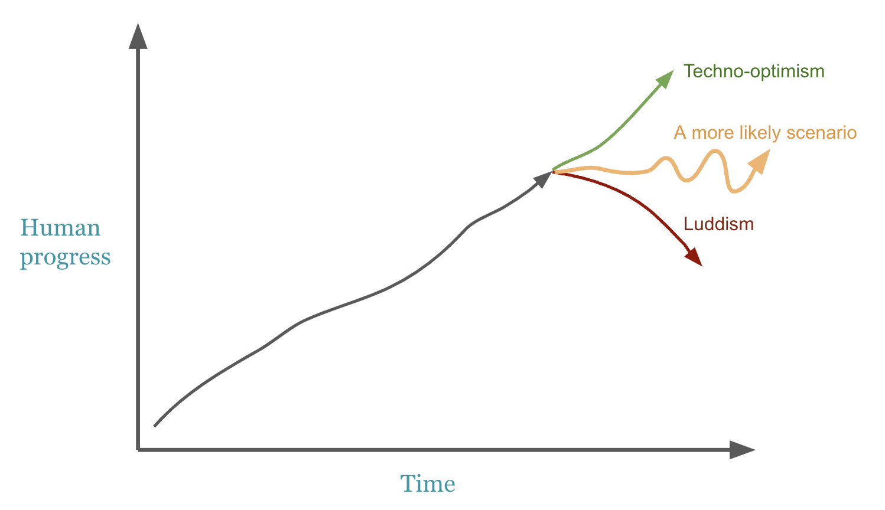

Public opinion on big tech is predominantly doom and gloom today. We point at corporate greed and late stage capitalism redistributing wealth to the 1%, with disregard to everything but shareholder value, at the expense of the populace. Since GPT and other Large Language Models (LLMs) our worries have worsened. What's more, it seems that the first effects of climate change are being seen, worldwide.

These worries are more than just warranted, and humanity is certainly in for a very challenging future. But as my first full article on a series about *humanising* data science and technology, I'd like us to think a bit deeper about these topics. When it comes to thinking about the future in our hands, and how technology impacts it, I'd like to make four main points that we as tech workers should think about
- We are living (or have lived) in a golden age
- It's possible that the [pursuit of growth](https://ryanandersonds.com/posts/Wrong-metric), technology and for that matter industrialisation have done irreversible damage
- When arguing around these things, we should avoid polarised arguments - the answer always lies somewhere along the spectrum
- However, we can't halt technological progress because it scares us
- All of this calls for pragmatic thinking - humans and nature are fragile, and technology can hurt us as much as it has gotten us to this golden age

Yes, these points are more political and philosophical than technical, but I think they will serve as a solid base for thinking about the decisions we make as data scientists, engineers and managers. Because some of us are going to make it big, and be making equally big decisions. These decisions are going to matter. 

Over the last few hundred years, technology has led to an unprecedented quality of life for humans, on average. When it comes to highlighting the positives of where technology has left us, [Superabundance](https://www.superabundance.com/) and [The Techno-Optimist Manifesto](https://a16z.com/the-techno-optimist-manifesto/) do a great job*. 
Compared to humans at any other point of time, we are very lucky:
- The global food supply has risen above the Recommended Dietary Allowance (RDA) needs for every human on this planet
- The global murder rate is at its lowest ever
- Advances in healthcare mean our life expectancy is higher than its ever been
- The cost of essential goods and services, due to trade and production, is at an all time low (Note: Yes, it doesn't feel that way in 2024. This was written in 2022, and I feel that they picked their bucket of 'essential' goods quite carefully)
- Capitalism and technology have worked wonders - relentless optimistic reinvestment of funds into technology, and the monetary incentives thereof, have been the main instrument in human progress over the last century

\*  *I want to make it clear that I agree with some facts posited in these sources, but disagree very hard with their overall premise of relentless positivity, because they miss one **VERY BIG** piece of logic*

There is no doubt that technology - the industrial revolution, the scientific method, and capitalism rewarding those who add value with heaps of money - has brought us to a golden age. We've put ourselves in a super efficient feedback loop. Innovation is rewarded with a lot of money, and venture capitalists are incentivised to fork out huge investments just for the chance of more innovation.

However, if you've read [Superabundance](https://www.superabundance.com/), [The Techno-Optimist Manifesto](https://a16z.com/the-techno-optimist-manifesto/), pieces about [Accelerationasm](https://www.thenewatlantis.com/publications/tech-strikes-back?utm_source=tldrnewsletter) or any other VC-written, relentlessly positive piece of writing, the main problem with their arguments is how polarised they are. In 575 pages, Superabundance does not once bring the obvious counterargument that you probably thought about just while reading the above: just because we've been in a golden age due to technology, capitalism and rewarding economic growth, it doesn't mean that we'll continue on the same trajectory. It's akin to driving at full speed towards backed-up traffic, ignoring the big accident you're about to cause because, well, so far everything has gone at full speed - why would this ever change? 

There's no reason that human progress should follow a linear curve.

“Whether you’re building a family, a startup, a spaceship, a robot, or better energy policy, _just build_,” [writes this anonymous human](https://www.effectiveacceleration.org/posts/4LtypqdAmQ3AgKtJD/what-the-f-is-e-acc) . “Do something hard. Do it for everyone who comes next. That’s it. Existence will take care of the rest.” No, no thats not how it works. Maybe if you grow up as a good looking, rich and privileged person in the USA, then you're used to everything being taken care of for you and things just working out, but in the real world, we face consequences.

The same level of criticism should go towards the other end of the spectrum: techno-pessimism: any anti-tech Luddite writings like [Blood in the Machine](https://www.goodreads.com/en/book/show/59801798) write about how we should fight back against technology, or we're doomed. They cherry pick arguments about jobs lost due to automation, whether through factories or AI. However, they ignore the main counterarguments - that unemployment rate has remained (while fluctuating) more or less the same since the early 1900s, and that our quality and length of life has increased.

The point I want to make here is very simple - we should avoid polarising our arguments, because it's blatantly obvious that the answer lies somewhere on the spectrum between relentless positivity and doom-and-gloom. In an argument for unpolarised arguments, Tim Urban's [What's our Problem](https://www.goodreads.com/en/book/show/102146148) makes the point that (especially politically), society is trending much more polarised. We are, thanks in great part to technology and media, reinforcing biases and narrow worldviews rather than fostering collaborative, diverse environments through constructive arguments. This is not good news - because there is no better tool for progress than collective, diverse thought. But culture (such as American politics), technology (such as algorithms driving engagement in Facebook and Youtube) are killing this process.

So, revising the matter at hand: We're in a golden age. Technological progress has led us here. But, there are two big, polarised arguments, which I'll write in caveman to illustrate the maturity of each said argument:
- Capitalism good. Technology great. Both full steam ahead. Technology save climate. Utopia come!
- Capitalism destroy earth. Corporations evil. Technology steal all jobs. Climate change kill all humans!

The undeniable truth is that **absolutely nobody knows enough to make a convincing argument in either direction**. It just depends on too many unknowns, philosophies, uncomfortable taboos, subjectivity, or things we can't measure yet. Here are three simple examples illustrate this:
- A common rhetoric is that since technology has answered almost all of humanity's plights thus far, it will also find a solution to climate change should we invest enough resources. For instance, nuclear fusion may soon solve our reliable energy source problems forever. But will this happen in 5 years, or in 100? The difference between those numbers mean countless lives.
- Relentless investment in growth and technology through capitalism has saved lives. But will the corresponding negative impact on the future (through any means, say for instance highly encouraged consumerism and waste from that), kill more people and animals than lives which have been saved through the positive side of technology? The same goes for happiness - have we had a net increase or decrease in happiness? For that matter, what is the value of a human life versus human happiness?
- We've caused the extinction of countless animal species in our pursuit of growth - is an animal life worth as much as a human life? Are an animal's feelings as important as a human's feelings?

None of those questions are answerable without either having strong philosophical opinions, information about the future, or both.

The core principle behind the damage from these unknowns is **fragility**. While I'll cover this in-depth in a future article with many examples, the concept is quite simple: technology now moves faster than humans, the environment, or virtually any ecosystem such as governments or economies can react and adapt. Our lack of adaptation can cause us damage, often unintended. Every ecosystem, person, or animal, is more fragile than we like to admit. Examples of each are:
- Human fragility: The negative mental health impact of social networks
- Socioeconomic fragility: Job losses due to LLMs. 
- Environmental fragility: Climate change
- Government fragility: Cambridge Analytica's [role](https://www.npr.org/2018/03/20/595338116/what-did-cambridge-analytica-do-during-the-2016-election) in the 2016 election of Trump

Historically, fragility has been massively overlooked in favour of profit. Big tech companies are now worth trillions, and taking over the world. They are so self-driven that they don't care about the future beyond beyond their next few years of profit. The window of their interests is far, far smaller than that of your children. Board members and other employees are abstracted from the damage these companies do - they have no blood on their hands. Chouinard, in [Let My People Go Surfing]() says "Limited liability corporations are institutions created explicitly to separate humans from the effects of their actions—making them, by definition, inhuman and inhumane." This ignorance, intentional or not, is almost entirely responsible for every worry we have about the world today.

Yet, on the other end of the spectrum, the same ignorance of fragility has no doubt led to a lot of innovation and technical progress. If we worried about everything that could go wrong, we would go nowhere.

## So what can we do?

This article started off reminding us to be positive about the world and technology, since we are indeed in a golden age. It discussed not to polarise our arguments about this, since nobody knows enough to make a convincing argument in either direction. Finally, it urges us to think about technology in terms of the damage it can do to fragile systems. But what does this mean for us as tech workers?

Continually bring your curious mind back to **fragility**. See the consequences of your innovation, and the interaction between humans and technology is as important as the technology itself. Over the next few years, not only are we going to be slow to react to technology, we're also going to have to be proactive - for instance, some concepts like Universal Basic Income and Reeducation are already pivotal as careers are more rapidly replaced by automation.

**Focus on factfulness** in our world of worries, fake news, misinformation and greed. Learn to think critically and separate worries versus facts versus can't-knows. When faced with uncertainty, remember: as a data scientist, your job is to find the facts, or at least the highest probabilities!

Quite simply, since technology moves faster than almost anything can react, as the rank and file of tech organisations, its up to us **we need to pragmatically point technology in the right direction**. Every decision we make contributes towards the magnitude and direction of technological progress, and this impacts systems before they can react.

It's no small feat.
