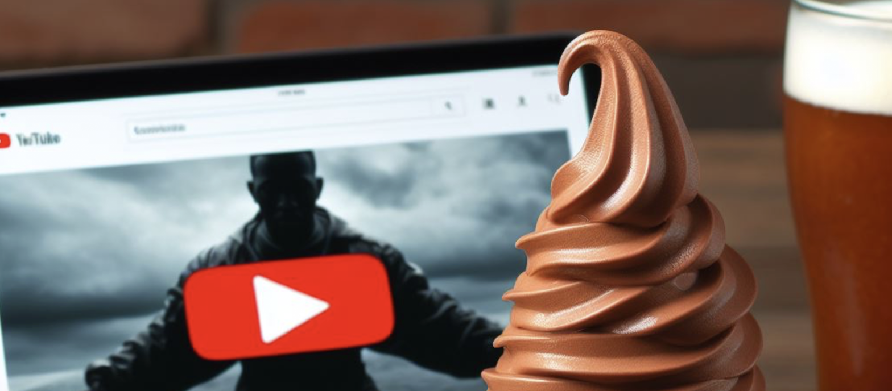
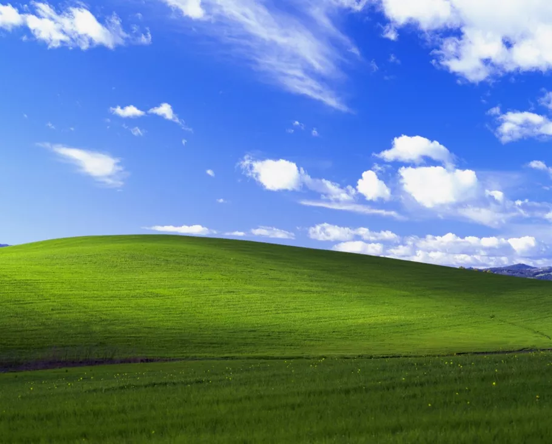

In my previous article, I encouraged pragmatism when building the technologies that power our future. While we are experiencing a golden age of technological advancement that has significantly improved the quality of life, this progress can come with irreversible damages and challenges due to the frailty of humans and ecosystems. Now, let's explore one of the reasons why technology doesn't lead us down the perfect, sunny path to utopia.

We're going to zoom into one of the most popular areas of negative talk about tech these days: About how digital products have very suddenly been getting worse, and more expensive, as they scramble for profits. The process has been dubbed "[enshittification](https://www.ft.com/content/6fb1602d-a08b-4a8c-bac0-047b7d64aba5)," "bitrot," "platform decay" and many other names. 

Regardless of the name, it's affecting so many of the platforms we use. Big tech is starting to squeeze its users, advertisers and other clients for profit. Digital products capable of doing good are being corrupted in search of profits.

Let's take YouTube as an example. 

YouTube is one of the classic examples of innovation in our lifetime. It was founded because there was no easy way to upload and share videos on the internet - and founded the good old way - in a garage, by a few guys. No denying the main reason for their founding was to probably get rich. But the point is, YouTube was real innovation. It pioneered online video, turning video into an asynchronous form of communication for the masses.

Yet YouTube in its current state is far from optimal, having made a lot of changes purely for profit. To name but a few things:
- **Degrading product quality for engagement**: Probably the most damning of all changes. YouTube removed the Thumbs Down count, so users can no longer see if a video is of bad quality before watching it. There's no positive way to put this - it makes us watch poor quality content more often. It's wasting millions of hours of humanity's time, in the name of engagement.
- **Squeezing users for profit**: Ads were introduced in 2007, but it was in 2018 that YouTube premiered the "Two Ads" feature, with the second one being unskippable, Adblock blockers, and even (very irrelevant) surveys as ads. They did this under the guise of giving creators a boost in revenue - but if so, why are these ads also shown on videos of creators who upload their videos for free - i.e. not Partners? Now the second side of the coin - offering no ads for YouTube Premium. 
- **Squeezing content creators**: YouTube is forcing content creators to play by algorithm rules, primarily incentivising quantity of content over quality of content - sticking to a schedule, releasing videos of minimum duration. As [one creator put it](https://youtu.be/tAfaXFIcuvc?t=437) , "Everything online is converging to a bland, grey middle point where everyone is trying to maximise \[metrics\]... which just leads everyone to the same end product"

YouTube's profit seeking has led to suboptimal technology.

We don't know what the "optimal" direction of YouTube over the years would have been if not chasing profits, but we could surmise that if it only needed to break even, we'd see fewer ads per video, definitely never two adverts in a row. We wouldn't see content creators be pushed to make more and longer content than they wanted, but we'd see creators incentivised for video quality above all else. And of course, we'd see a dislike button.

(Note: Alphabet doesn't share profitabilty per product, so we don't know if YouTube is actually profitable. We can assume so, though it made [$29B revenue]( https://abc.xyz/assets/d4/4f/a48b94d548d0b2fdc029a95e8c63/2022-alphabet-annual-report.pdf) in 2022, 10% of all of Alphabet's revenue. It's also not fair to judge the profitability of a single product of Alphabet's, because they need to use some as cash cows for research and development in other departments) 

A lot of things YouTube has done probably don't fall under the "enshittification" umbrella - some are quite reasonable, maybe with the exception of removing the Thumbs Down count. YouTube is an expensive business to run, employees a lot of people, and needs to pay content creators for their content. A lot of what YouTube has done could, to an optimist, just be the floundering of an industry leader trying to generate as much profit as possible without stepping over the line and losing too many users. And, being an industry pioneer, it could be excused for sometimes finding that line.

*If a part of this image looks suspiciously like ice cream, that's because it is: Dall-E doesn't allow you to generate any content related to extrement*

We not only have lived through a historic golden age for humanity (relative to all of history), those of us who have been using the internet since the early 2000s probably also lived through the golden age of the internet. Massive investment flowed in to platforms, and you and I reaped the benefits. It's something of a combination of the now cliche "If you're not paying, *you* are the product", but also something else less talked about: We as users were a combination between debtors - using a service for free, only to pay in the future, and early ponzi scheme adopters - our network effects being used to bring more users and advertisers onto the platforms, and *they'd* pay for it as we had the option to jump ship.

The internet brought us sudden free videos (YouTube), music (Deezer), messaging, pornography, news, and many other services. We got a bit too used to it. Now the debt collector has come knocking. A bit too hard, though.

## But sometimes, things start to get a bit too shitty

Here's where we could draw the line between *reasonable* profit taking and *enshittification*. 

Exacerbated by pursuit of endless growth and not just turning a net profit, but a higher net profit each year, some companies have turned towards Enshittification, defined as a four stage process specific to digital **platforms**:
1. Companies use investors' money to reel in a lot of users and generate network effects
2. Because of the network effects - all of your friends, contacts, business, etc. are on the platform, you as a customer are stuck. The platform squeezes customers through [dark patterns](https://en.wikipedia.org/wiki/Dark_pattern), spam, excess ads, while quality of service dwindles. Back to our example, YouTube is definitely in this phase - with market dominance, we as users are now putting up with worse platform quality (like no Thumbs Down count, too many ads). The key here is that abusing users make things better for their business partners (creators and advertisers), growing a critical mass of partners.
3. Now, with a mass of users even less willing to leave (especially in YouTube's case, since content creators can make very good money), the platform begins squeezing partners such as advertisers and creators, making them pay or work more, because what other platform options are there? This one has all the users. Here, compelling partners to make quantity of content over quality is a prime example of step 3. 
4. Steps 2 and 3 continue until every possible bit of margin is extracted from users and partners and given to shareholders. Finally, something breaks. Users and or partners hit a breaking point, where service quality has deteriorated so much that users don't care about the challenges of leaving. They find another platform. Savvy startups succeed and gain VC funds because it's so easy to offer a better experience. This hasn't happened with YouTube yet, but platforms like Facebook, Instagram, Netflix have lost entire generations of users. 

The Enshittification process isn't inevitable, or even intentional - although it's highly probable for any publicly traded company that's expected to make more profits each year. Sometimes, though, we see the less intentional [bitrot](https://andrewkelley.me/post/why-we-cant-have-nice-software.html?utm_source=tldrnewsletter).

Bitrot occurs as near-perfect software, still maintained by large companies, feel obliged to change things. But sometimes there's not much to change for the better, and you end on making things worse, adding bloatware. Windows is such an example - what has actually changed for the good in the last 20 years? We've been through redesign and redesign, such as fancy settings screens lazily layered on top of the old control panel, but Windows XP is still the best operating system we've seen. 

## Can we combat enshittification?

Firstly, at least based on a lot of negativity floating around these days, I think we need to recognise that we really have just lived through the golden days of the internet where a ridiculous number of services were free. If you brought someone from 30 years ago to 2010, they'd be astounded at the ability to read about anything for free on Wikipedia, watch videos for free on YouTube, listen to music for free on Deezer, and watch so much content on Netflix.

Now that some services have deteriorated or become too costly in search of profit, there's no better way than to walk away from them. Surprise yourself with how little you actually need that Amazon Prime subscription, that Facebook account. 

Now knowing the steps of Enshittification, try live in step 1. There are always free or cheap services looking to gobble up as many new users as they can - such as the early extremely cheap days of Uber. Be an early adopter. Show no loyalty to platforms whatsoever. Run adblockers if ads aren't relevant to you. Install Brave browser to be less trackable for ads.

As data scientists building and maintaining these big tech platforms, we owe it to the longevity of our companies to find better ways of doing things than the *shitty* way. 

Stay tuned! Most of the Humanising Data Science series I'm writing is going to be about combatting enshittification. Not only because it's morally wrong, but because it will truly be a differentiator in the next 10 years for our companies as users get less patient with our platforms.
